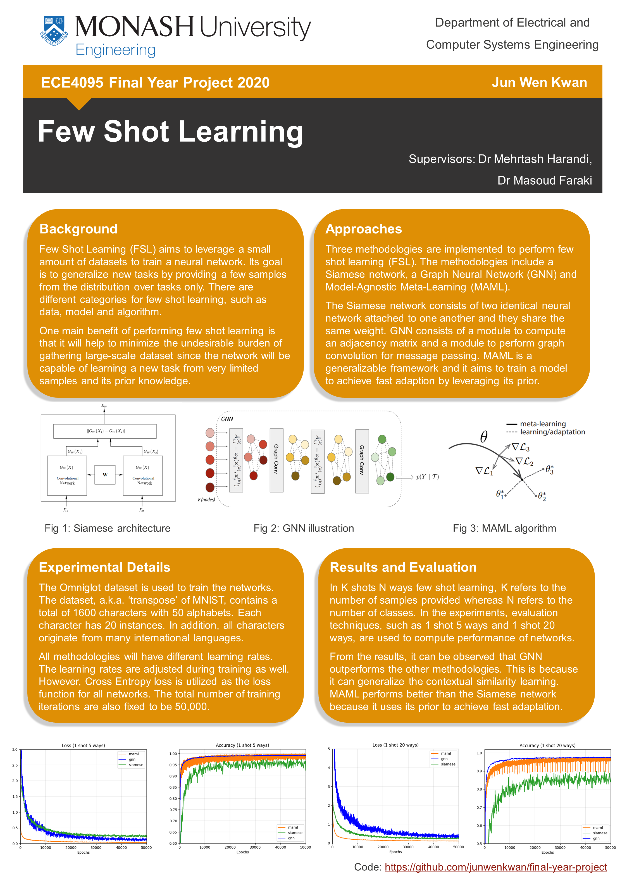
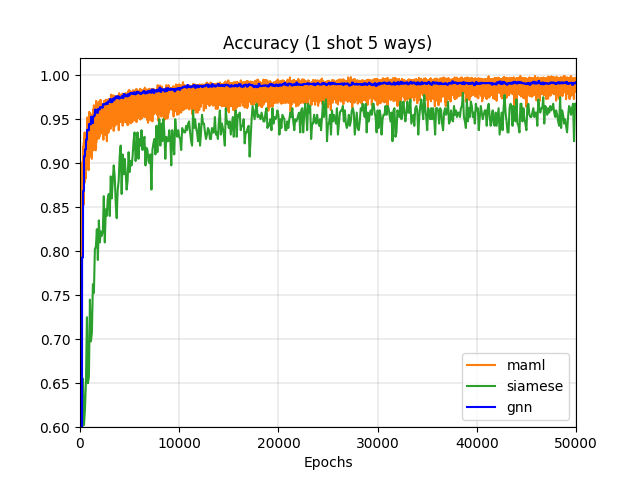
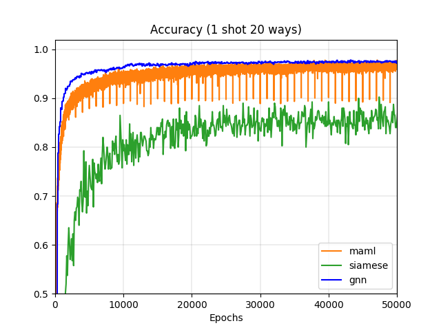
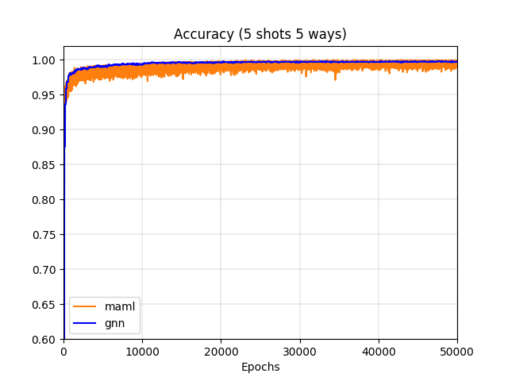
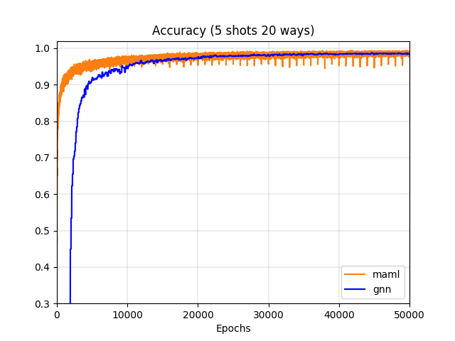
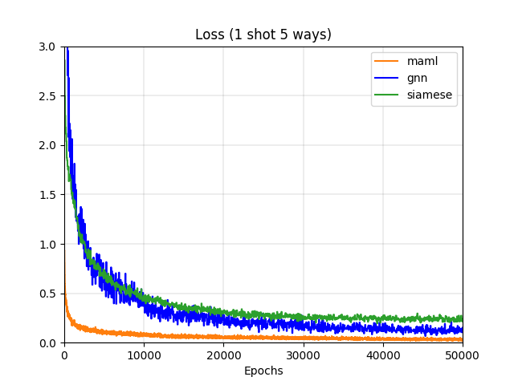
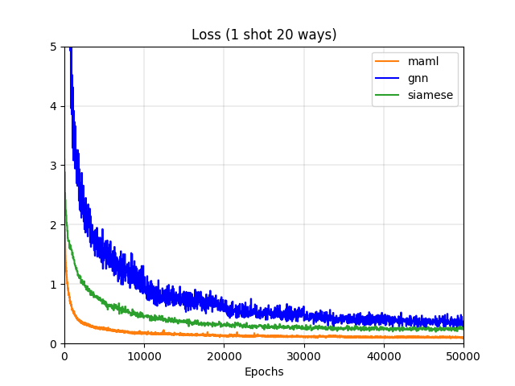
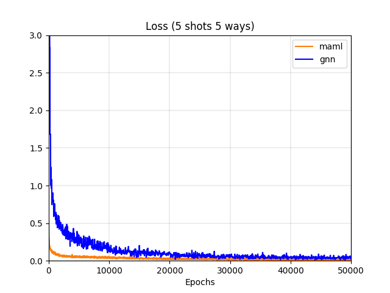
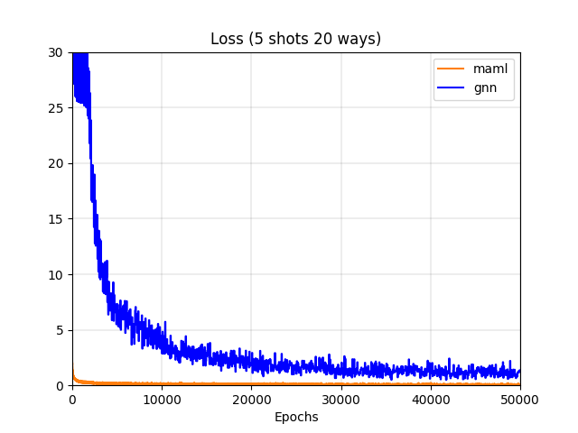

# ECE4095 Final Year Project
* This is my final year project at Monash University. 
* This project is supervised by Dr Mehrtash Harandi and Dr Masoud Faraki.
* ECSE Spark Night 2020 website: [https://www.ecsespark.com/draft-b/few-shot-learning](https://www.ecsespark.com/draft-b/few-shot-learning)

## Few-Shot Learning 
Few-shot learning experiments include:
* Siamese network [[paper](https://www.cs.cmu.edu/~rsalakhu/papers/oneshot1.pdf)]
* Graph Neural Network (GNN) [[paper](https://openreview.net/pdf?id=BJj6qGbRW)]
* Model-Agnostic Meta-Learning (MAML) [[paper](https://arxiv.org/pdf/1703.03400.pdf)]
## Poster

## Results
The overall results are summarized below.
|              | 1 shot 5 ways | 1 shot 20 ways|
| ------------ | ------------- | ------------- |
| Siamese Net [1]  | 95.3% | 85.7% |
| MAML [2]  | 99.2% | 96.6% |
| GNN [3]  | 99.3% | 97.8% |

|              | 5 shots 5 ways | 5 shots 20 ways|
| ------------ | ------------- | ------------- |
| MAML  | 99.6% | 98.0% |
| GNN   | 99.7% | 98.5% |

| 5 ways      | 20 ways       |
| -------------- | -------------- |
|  |  |
|  |  |

| 5 ways      | 20 ways       |
| -------------- | -------------- |
|  |  |
|  |  |

## References
[1] G. Koch, R.Zemel and R.Salakhutdinov, “Siamese Neural Networks for One-shot Image Recognition”, Proceedings of the 32nd International Conference on Machine Learning, vol 37, 2015.

[2] C. Finn, P. Abbeel and S. Levine,“Model-Agnostic Meta-Learning for Fast Adaptation of Deep Networks”, Proceedings of the 34th International Conference on Machine Learning (PMLR), 2017.

[3] V. Garcia and J. Bruna, “Few-Shot Learning with Graph Neural Networks”, Sixth International Conference on Learning Representations (ICLR), 2018.

## Credits
* [fangpin/siamese-pytorch](https://github.com/fangpin/siamese-pytorch)
* [vgsatorras/few-shot-gnn](https://github.com/vgsatorras/few-shot-gnn)
* [dragen1860/MAML-Pytorch](https://github.com/dragen1860/MAML-Pytorch)
